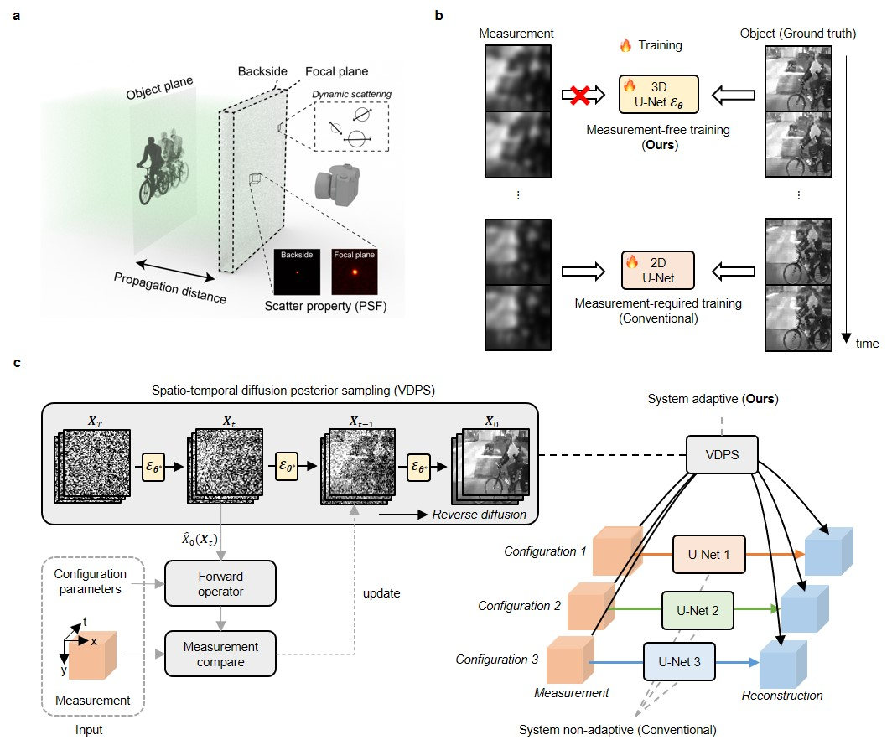

# Video Reconstruction Through Dynamic Scattering Medium via Spatio-Temporal Diffusion Models

<p align="center" width="100%">
    
    
    
    
</p>

<p align="center" width="100%">
    
</p>


## Abstract
We present a novel inverse scattering solver utilizing a video diffusion model for imaging through highly scattering media. By deriving a closed-form forward model from the shower-curtain effect, we introduce a video diffusion posterior sampling scheme with temporal attention, maximizing the statistical correlation between frames and scattered signals. Our approach demonstrates adaptability across diverse scenarios, including various scene types, scattering media thicknesses, and scene-medium distances. Emphasizing the incorporation of temporal correlation, our method accurately captures high-frequency components often missed by spatial-domain operations alone. Simulation and real experimental results using different datasets and optical setups validate the effectiveness of our approach. To the best of our knowledge, this is the first video diffusion model to exploit correlations in both spatial and temporal domains for solving the inverse scattering problem.


## Prerequisites
- python 3.10

- pytorch 1.13.1

- CUDA 11.7

It is okay to use lower version of CUDA with proper pytorch version.

Ex) CUDA 10.2 with pytorch 1.7.0

<br />

## Getting started 

### 1) Clone the repository

```
git clone https://github.com/star-kwon/VDPS-optica

cd VDPS-optica
```

<br />

### 2) Download pretrained checkpoint and sample videos
From the [link](https://drive.google.com/drive/folders/1-Zu7GL2dooGFJYEO34s9U0J03LKqd6I6?usp=sharing), download the checkpoints and paste it to ./models/, download the samples and paste it to ./scatter samples/
```
mkdir models
mkdir scatter samples
mv {MODEL_DOWNLOAD_DIR}/{CHECKPOINT NAME} ./{models}/
mv {SAMPLE_DOWNLOAD_DIR}/{SAMPLES} ./{scatter samples}/
```
{DOWNLOAD_DIR} is the directory that you downloaded checkpoint to.
{PASTE_DIR} is the directory that you should paste to.

<br />

### 3) Set environment
Install dependencies

```
conda create -n VDPS python=3.10

conda activate VDPS

pip install -r requirements.txt

pip install torch==1.13.1+cu117 torchvision==0.14.1+cu117 torchaudio==0.13.1 --extra-index-url https://download.pytorch.org/whl/cu117
```

<br />

### 4) Test

```
python test_UCF.py
python test_VISEM.py
```

<br />
